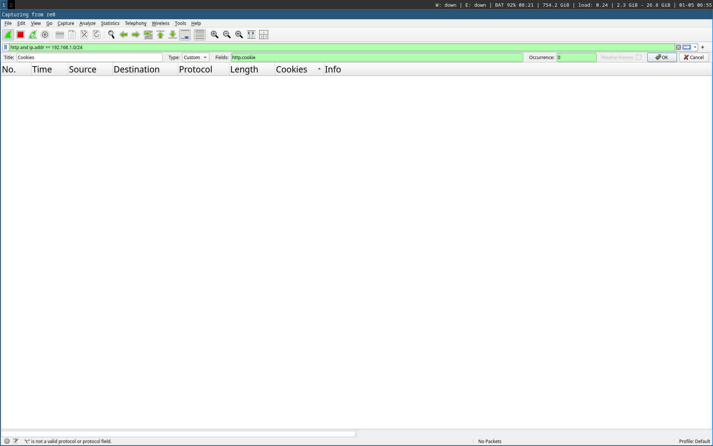

Pour faire l'interception réseau, vous pouvez le faire:

 1. Sur la même machine
 2. Avec des machines virtuelles/conteneurs/jails
 3. Avec de vraies machines

A noter que certaines chosent perdent un peu de leur sens lorsque
la victime et les serveurs ne sont pas des hôtes séparés.

C'est pourquoi il est recommandé de faire les points 2 ou 3.

La configuration du réseau proposée est la suivante:

```
 +---------+ 
 | Victime |
 +---------+ 192.168.1.2
      *
      |
      |192.168.1.0/24
      |
      |
+-----*-----+ 192.168.1.1
| Attaquant |
+-----*-----+ 192.168.2.1
      |
      |
      | 192.168.2.0/24
      |
      |
+-----*---+ 192.168.2.2/24
| Serveur |
+---------+
```

Où les différents serveurs (forum, malveillance, ...) tournent sur la même machine.

Pour faire seulement du sniffing il n'est pas nécessaire d'être "au milieu". Par
exemple il suffit d'être sur le même réseau WiFi.

# Wireshark

On configure Wireshark pour écouter sur le port qui communique avec la victime.

On filtre les paquets réseau qui nous intéressent:

```
http and ip.addr == 192.168.1.0/24
```

et on crée une colonne avec pour champ `http.cookie` et titre `Cookies`.



# L'attaque

Lorsque la victime fait une requête en étant connectée on voit
apparaître un cookie avec pour nom `jwt_token`.

On peut copier cette valeur dans les cookies du navigateur de
l'attaquant en étant sur la page du forum. On constate alors
qu'on est connecté.
